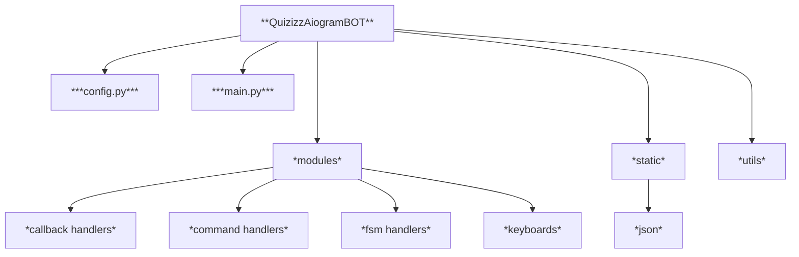

# Quizizz Telegram Bot

## About
This **BOT** provides an opportunity for the teacher to run tests from loaded `.json` file for a group of students with access via code

## Navigation
- [Installation](#installation)
- [Technologies used](#technologies-used)
- [Project structure](#project-structure)
## Installation

1. Clone the repository
```
git clone https://github.com/rainofpain/QuizizzAiogramBot-.git
```
2. Choose main directory of the project
```
cd QuizizzAiogramBot-
```
3. Create virtual environment
```
python -m venv venv
```
4. Activate virtual environment
* Activation for **Git Bash**
```
source venv/Scripts/activate
```
* Activation for **Windows Powershell**  
     
1. Allow execution of local scripts
```
Set-ExecutionPolicy -ExecutionPolicy RemoteSigned -Scope CurrentUser
```
2. Activate **venv**
```
venv\Scripts\Activate.ps1 
```

* Activation for **Windows cmd**
```
call venv/Scripts/activate
```
* Activation for **MacOS** / **Linux**
```
source venv/bin/activate
```
5. Install all required packages
```
pip install -r requirements.txt
```
6. Create your own `.env` in main directory

7. Fill your `.env` with the information required for the **bot** as in the `.env-sample` file in main directory

8. Run the project (run `main.py`)
```
python main.py
```
---
## Technologies Used

>[**Back to navigation**](#navigation) 
 
| **Technology**  | **Description** |
| :-------------: | -------------      |
| [Aiogram](https://docs.aiogram.dev/)| The *main technology* on which the **bot** is built|
| [Python](https://www.python.org/)| Primary programming language|

---
## Project structure

>[**Back to navigation**](#navigation)


