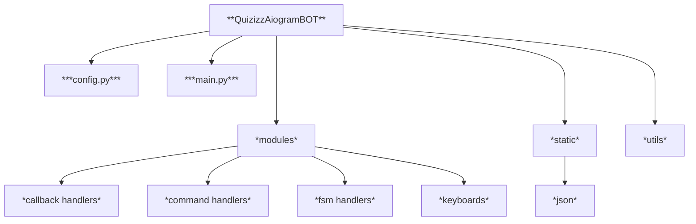

# Quizizz Telegram Bot


<p>
    
<p>


## About
This **BOT** provides an opportunity for the teacher to run tests from loaded `.json` file for a group of students with access via code

## Navigation
- [Installation](#installation)
- [Technologies used](#technologies-used)
- [Project structure](#project-structure)
- [Documentation](#documentation)
- [Project future](#project-future)
- [Project summary](#project-summary)
## Installation

1. Clone the repository
```
git clone https://github.com/rainofpain/QuizizzAiogramBot-.git
```
2. Choose main directory of the project
```
cd QuizizzAiogramBot-
```
3. Create virtual environment
```
python -m venv venv
```
4. Activate virtual environment
* Activation for **Git Bash**
```
source venv/Scripts/activate
```
* Activation for **Windows Powershell**  
     
1. Allow execution of local scripts
```
Set-ExecutionPolicy -ExecutionPolicy RemoteSigned -Scope CurrentUser
```
2. Activate **venv**
```
venv\Scripts\Activate.ps1 
```

* Activation for **Windows cmd**
```
call venv/Scripts/activate
```
* Activation for **MacOS** / **Linux**
```
source venv/bin/activate
```
5. Install all required packages
```
pip install -r requirements.txt
```
6. Create your own `.env` in main directory

7. Fill your `.env` with the information required for the **bot** as in the `.env-sample` file in main directory

8. Run the project (run `main.py`)
```
python main.py
```
---
## Technologies Used

>[**Back to navigation**](#navigation) 
 
| **Technology**  | **Description** |
| :-------------: | -------------      |
| [Aiogram](https://docs.aiogram.dev/)| The *main technology* on which the **bot** is built|
| [Python](https://www.python.org/)| Primary programming language|
| [JSON](https://pyneng.readthedocs.io/ru/latest/book/17_serialization/json.html)| *module* used to work with `.json` files|
|[Asyncio](https://docs.python.org/3/library/asyncio.html)|*library* used to make **bot** work in asynchronous mode|
---

## Project structure

>[**Back to navigation**](#navigation)



## Documentation

>[**Back to navigation**](#navigation)

Documentation contains short description for each package and module to explain the main features

---
<details>
<summary> modules/ </summary>
<p></p>

`modules/` -> contains the parts on which the main functionality is based

<details>
<summary> command_handlers/ </summary>
<p></p>

`command_handlers/` -> contains the modules for command handlers that enable bot–user interaction via commands
</details>

<details>
<summary> callback_handlers/ </summary>
<p></p>
<p> Callback Handlers -> contains the modules for сallback handlers that process callback events</p>

<details>
<summary> answer_button_callback </summary>
<p></p>
<p> Callback Handlers -> contains the modules for сallback handlers that process callback events</p>

<details>
<summary> answer_button.py</summary>
<p></p>
<p> Module contains an asynchronous function that update user`s message with answers till the test not over, and update user`s test progress data during the test passing</p>

```python
import aiogram.types as types
import json

from config import dispatcher, AnswerButtonCallback, active_tests_list, bot
from utils import create_path, check_entry_code, check_user_id
from ...keyboards import answer_keyboard
from .lobby_progress import lobby_progress


@dispatcher.callback_query(AnswerButtonCallback.filter())
async def answer_button_callback(callback_query: types.CallbackQuery, callback_data: AnswerButtonCallback):
    
    filename = callback_data.filename
    entry_code = callback_data.entry_code
    question_number = callback_data.answer_key + 1
    
    callback_user_id = callback_query.from_user.id
    
    
    with open(create_path(filename)) as file:
        loaded_file = json.load(file)
    
    test_length = len(loaded_file["questions"].keys())
    
    
    buttons_list = []
    answer_keyboard.inline_keyboard = []
    
    if question_number <= test_length:
        
        question = loaded_file["questions"][f"{question_number}"]["text"]
        correct = loaded_file["questions"][f"{question_number}"]["correct"]
        answers_list = loaded_file["questions"][f"{question_number}"]["answers"]
        
        for answer in answers_list:
            button = types.InlineKeyboardButton(
                text = answer, 
                callback_data = AnswerButtonCallback(
                    answer_key = question_number,
                    correct_answer = correct,
                    index = answers_list.index(answer),
                    filename = filename,
                    entry_code = entry_code                       
                    ).pack()
                )
            buttons_list.append(button)
            
        answer_keyboard.inline_keyboard.append(buttons_list)
        
        for test in active_tests_list:
            if check_entry_code(test, entry_code):
                for user in test["students_list"]:
                    if check_user_id(callback_user_id, user["user_id"]):
                        user["user_progress"] += 1
                        if callback_data.correct_answer == callback_data.index:
                            user["user_points"] += 1
                        await bot.edit_message_text(
                            chat_id = user["user_id"],
                            message_id = user["user_message_id"], 
                            text = question,
                            reply_markup = answer_keyboard
                        )
                        break
                
                await lobby_progress(
                    test = test,
                    entry_code = entry_code,
                    test_length = test_length
                )
                
                break
    else:
        for test in active_tests_list:
            if check_entry_code(test, entry_code):
                for user in test["students_list"]:
                    
                    if check_user_id(callback_user_id, user["user_id"]):
                        user["user_progress"] += 1
                        if callback_data.correct_answer == callback_data.index:
                            user["user_points"] += 1
                        
                        await bot.edit_message_text(
                            chat_id = user["user_id"],
                            message_id = user["user_message_id"], 
                            text = f"Тест завершено!\n Правильніх відповідей: {user["user_points"]}"
                        )
                        
                        break
                
                await lobby_progress(
                    test = test,
                    entry_code = entry_code,
                    test_length = test_length
                )
                
                break
```

</details>

<details>
<summary> lobby_progress.py </summary>
<p></p>
<p> Module contains the utility function to update lobby progress message in mentor`s chat, while test is active</p>

```python
async def lobby_progress(test: dict, entry_code: str, test_length: int):
    lobby_progress = "\n".join(f"{user["user_lobby_name"]}: {user["user_progress"]}/{test_length}" for user in test["students_list"])
    
    mentor_id = test["mentor_id"]
    mentor_message_id = test["message_id"]
    
    await bot.edit_message_text(
        chat_id = mentor_id,
        message_id = mentor_message_id, 
        text = f"Прогресс проходження тесту:\n {lobby_progress}",
        reply_markup = types.InlineKeyboardMarkup(inline_keyboard = [
            [
                types.InlineKeyboardButton(
                    text = "Завершити тест", 
                    callback_data = FinishTestCallback(entry_code = entry_code).pack()
                )
            ]
        ])
    )
```

</details>

</details>

<details>
<summary> finish_test_callback.py </summary>
<p></p>
<p> Callback Handlers -> contains the modules for сallback handlers that process callback events</p>

</details>

<details>
<summary> start_test_callback.py </summary>
<p></p>
<p> Callback Handlers -> contains the modules for сallback handlers that process callback events</p>

</details>

<details>
<summary> test_callback.py </summary>
<p></p>
<p> Callback Handlers -> contains the modules for сallback handlers that process callback events</p>

</details>

---

</details>

<details>
<summary> FSM Handlers </summary>
<p></p>
<p> State groups -> contains modules with FSM handlers for managing user interactions </p>

<details>
<summary> fsm_join.py </summary>
<p></p>
<p> Contains an asynchronous function that opens user authorisation state, lets the user to a test via code, and saves their data while the test is active </p>

```python
mport aiogram.fsm.context as context
import aiogram.types as types

from config import dispatcher, active_tests_list
from ..state_groups import JoinState, LobbyAuthorizationState

@dispatcher.message(JoinState.code)
async def update_join_state(message: types.Message, state: context.FSMContext):
    
    is_code_in_list = False
    entered_code = message.text
    
    await state.update_data(code = message.text)
    
    for test in active_tests_list:
        if entered_code == test["entry_code"]:
            user_info = {
                "user_id": message.from_user.id,
                "user_lobby_name": "",
                "user_message_id": None,
                "user_progress": 0,
                "user_points": 0
            }
            
            if len(test["students_list"]) == 0:
                test["students_list"].append(user_info)
                await state.clear()
                await message.answer(text = "Введіть ваше ім'я: ")
                await state.set_state(LobbyAuthorizationState.lobby_name)
                is_code_in_list = True
                
                break
            
            elif len(test["students_list"]) > 0:
                for user in test["students_list"]:
                    if user_info["user_id"] == user["user_id"] and user["user_lobby_name"] != "":
                        await message.answer(text= "Користувач вже є в списку")
                        is_code_in_list = True
                        
                        break
                    else:    
                        test["students_list"].append(user_info)
                        await state.clear()
                        await message.answer(text = "Введіть ваше ім'я: ")
                        await state.set_state(LobbyAuthorizationState.lobby_name)
                        is_code_in_list = True
                        
                        break
                
                break
        else: 
            is_code_in_list = False
    
    if is_code_in_list == False:
        await message.answer(text = "Такого коду немає!")
        
        await state.clear()
        
        await message.answer(text = "Введіть код: ")
        await state.set_state(JoinState.code)
```

</details>

<details>
<summary> fsm_lobby_authorization.py </summary>
<p></p>
<p> Contains an asynchronous function that updates the lobby message in the mentor's chat whenever a new user registers for the test, while test not started</p>

```python
import aiogram.fsm.context as context
import aiogram.types as types

from config import bot, dispatcher, active_tests_list, StartCallback
from ..keyboards import start_test_keyboard
from ..state_groups import LobbyAuthorizationState


@dispatcher.message(LobbyAuthorizationState.lobby_name)
async def update_lobby_authorization_state(message: types.Message, state: context.FSMContext):
    
    user_id = message.from_user.id
    lobby_name = message.text
    
    await state.update_data(lobby_name = lobby_name)
    
    user_message = await message.answer("Чейкайте початку тесту")
    user_message_id = user_message.message_id
    
    for test in active_tests_list:
        for user in test["students_list"]:
            if user_id == user["user_id"]:
                user["user_lobby_name"] = lobby_name
                user["user_message_id"] = user_message_id
                mentor_id = test["mentor_id"]
                mentor_message_id = test["message_id"]
                
                filename = test["loaded_test_name"]
                entry_code = test["entry_code"]
                lobby_names = ", ".join(user["user_lobby_name"] for user in test["students_list"])
                
                if len(test["students_list"]) > 0:
                    start_test_keyboard.inline_keyboard[0][0] = types.InlineKeyboardButton(
                        text = "ПОЧАТИ ТЕСТ", 
                        callback_data = StartCallback(filename = filename, entry_code = entry_code).pack()
                    )
                
                await bot.edit_message_text(
                    chat_id = mentor_id,
                    message_id = mentor_message_id, 
                    text = f"Всі учасники: \n{lobby_names}",
                    reply_markup = start_test_keyboard
                )
                break
    await state.clear()
```

</details>

---

</details>

<details>
<summary> State groups </summary>
<p></p>
<p> State groups -> сontains modules with state classes used in the bot's finite state machine </p>

<details>
<summary> join_state_group.py </summary>
<p></p>
<p> Contains state class named JoinState used in the bot's finite state machine to receive the entry code from user</p>

```python
import aiogram.fsm.state as state

class JoinState(state.StatesGroup):
    code = state.State()
```

</details>

<details>
<summary> lobby_authorization_state_group.py </summary>
<p></p>
<p> Contains state class named LobbyAuthorizationState used in the bot's finite state machine to receive the enterd lobby name from user</p>

```python
import aiogram.fsm.state as state

class LobbyAuthorizationState(state.StatesGroup):
    lobby_name = state.State()
```

</details>

---

</details>

<details>
<summary> Keyboards </summary>
<p></p>
<p> Keyboards -> contains the module with keyboard objects</p>
<details>
<summary> test_keyboards.py </summary>
<p></p>
<p> Module contains inline keyboard objects for test</p>

```python 
import aiogram.types as types

test_keyboard = types.InlineKeyboardMarkup(inline_keyboard = [])

start_test_keyboard = types.InlineKeyboardMarkup(inline_keyboard = [[
    types.InlineKeyboardButton(text = "", 
        callback_data= "start_test")
]])

answer_keyboard = types.InlineKeyboardMarkup(inline_keyboard = [])
```

</details>

</details>

</details>

---

<details>
<summary> utils/ </summary>
<p></p>
<p>Utils -> collection of utility functions used across the project</p>

<details>
<summary> check_entry_code.py </summary>
<p></p>
<p> Module contains a function that checks whether the entered code matches with the entry code in list</p>

```python
def check_entry_code(test: dict, entry_code: str) -> bool:
    
    if test["entry_code"] == entry_code:
        return True
    else:
        return False
```

</details>

<details>
<summary> check_user_id.py </summary>
<p></p>
<p>Utils -> Module contains a function that checks whether callback user id matches with the saved user id from user dict</p>

```python
def check_user_id(callback_user_id: int, user_id: dict) -> bool:
    if callback_user_id == user_id:
        return True
    else:
        return False
```

</details>

<details>
<summary> create_code.py </summary>
<p></p>
<p>Module contains a function that generates random six-digit code</p>

```python
def create_code() -> str:
    code = ""
    
    for number in range(6):
        code += str(random.randint(0,9))
    
    return code    
```

</details>

<details>
<summary> create_path.py </summary>
<p></p>
<p>Module contains a function that generates an absolute path for any file</p>

```python
import os


def create_path(path: str) -> str:
    try:
        path_elements_list = path.split("/")
        
        base_path = os.path.abspath(os.path.join(__file__, "..", ".."))
        
        for element in path_elements_list:
            base_path = os.path.join(base_path, element)
        
        path_file = os.path.abspath(base_path)
        
        return path_file
    except Exception as error:
        print(f"Помилка під час побудови абсолютного шляху до файлу: {error}")
```
</details>

</details>

---

<details>
<summary> config.py </summary>
<p></p>
<p>Contains configuration variables used across the project</p>

```python
import aiogram
import dotenv
import os

import aiogram.filters.callback_data as callback_data


dotenv.load_dotenv()

TOKEN = os.getenv("TOKEN")

bot = aiogram.Bot(token = TOKEN)
dispatcher = aiogram.Dispatcher()

mentors_id_list = []

entry_code_list = []

active_tests_list = []
"""
Ідея в тому щоб у цьому списку зберігати списки з інформацією про активні тести

у списку з інформацією про тест зміст елементів виглядає так:

test = ["code", "loaded_json", [students_list]]

"""


class StartCallback(callback_data.CallbackData, prefix = "start_test"):
    filename: str
    entry_code: str

class AnswerButtonCallback(callback_data.CallbackData, prefix = "answer_button"):
    answer_key: int
    correct_answer: int
    index: int
    filename: str
    entry_code: str


class FinishTestCallback(callback_data.CallbackData, prefix = "finish_test"):
    entry_code: str
```

</details>

---

<details>
<summary> main.py </summary>
<p></p>
<p>The main module from which the project is launched</p>

```python
import asyncio 

from config import dispatcher, bot
from modules import *


async def main():
    try:
        await dispatcher.start_polling(bot)
    except Exception as error:
        print(f"Помилка під час запуску проєкту: {error}")


if __name__ == "__main__":
    asyncio.run(main())
```

</details>

---

## Project Future

>[**Back to navigation**](#navigation)

some info

---

## Project Summary

>[**Back to navigation**](#navigation)